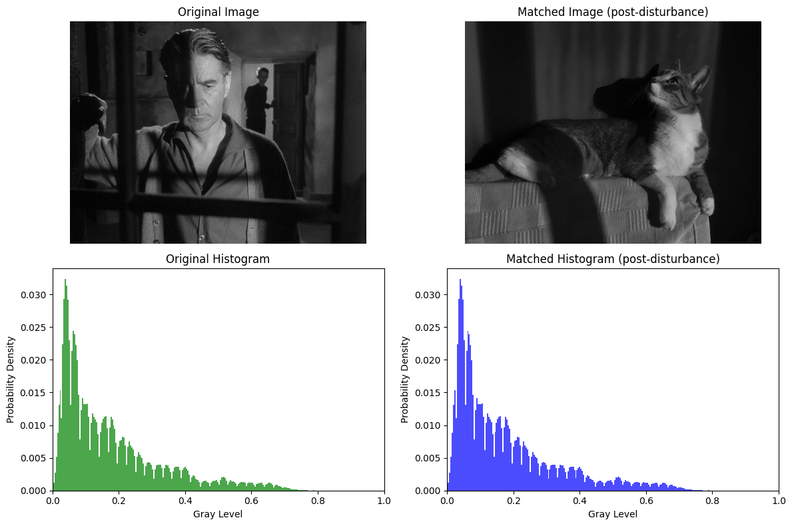
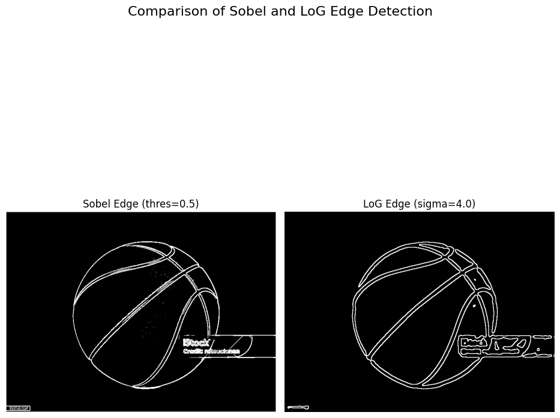
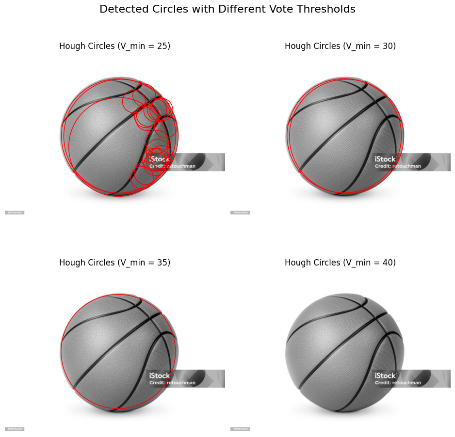

# Digital Image Processing – Course Exercises (AUTh 2024–2025)

This repository contains my exercises for the course **Digital Image Processing** at the Department of Electrical and Computer Engineering, Aristotle University of Thessaloniki (AUTh), academic year 2024–2025.

All algorithms are implemented **from scratch**, with an emphasis on understanding the underlying behavior of each method. The repository includes image enhancement, edge and shape detection, and graph-based image segmentation techniques.


## Implemented Methods

### Part 1 – Histogram Processing

* Histogram Equalization and Matching:

  * Greedy method
  * Non-greedy method
  * Post-disturbance method

**Results:**



### Part 2 – Edge and Shape Detection

* Edge Detection:

  * Sobel Operator
  * Laplacian of Gaussian (LoG)
* Circle Detection:

  * Hough Transform

**Results:**





### Part 3 – Image Segmentation

* Spectral Clustering
* Normalized Cuts (N-Cuts)


## Installation & Requirements

You can easily replicate the environment using **uv**:

```bash
uv sync
```

## Running the Code

Each demo can be executed as a module:

```bash
uv run -m src.part1.demo
```

Detailed execution instructions and experiment descriptions are provided in each part’s `docs/` directory.

---

## Running the Tests

All tests are written using **pytest**. To run the tests for any part:

```bash
uv run pytest
```


